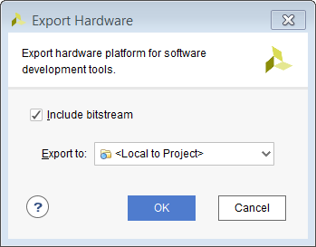
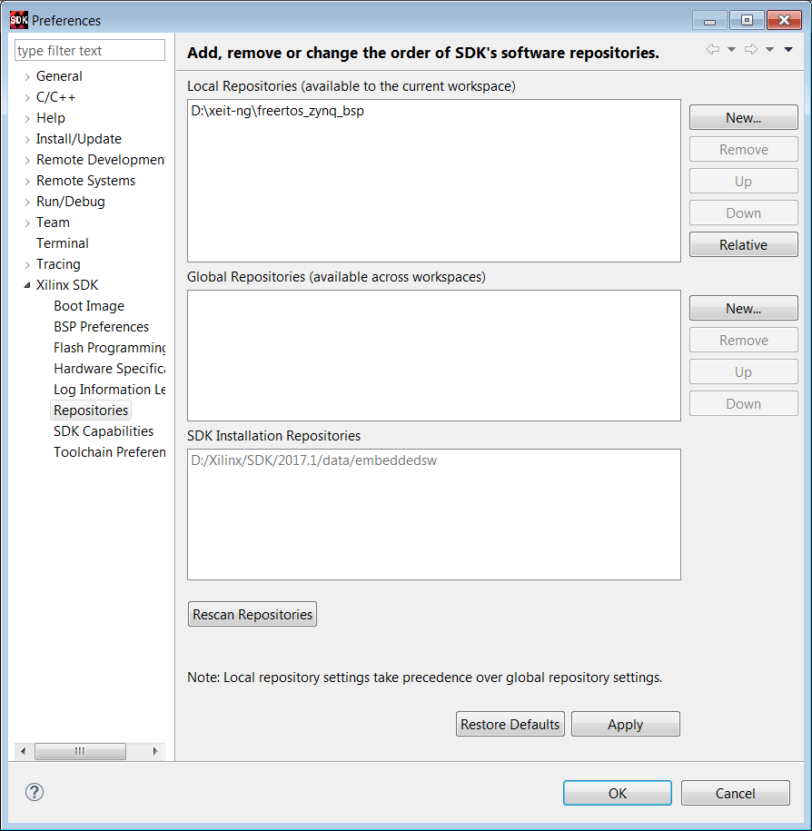

# Tutorial 01: Blinked LED

Every Zynq SOC project includes `hw` and `sw`. In the tutorial, the hardware is generated using `.tcl` scripts in the `hw_app` folder. Specifictly,  the `zynq_basic.tcl`.

## Generate the hardware and the bitstream

1. Create a folder and open Vivado, in the bottom, open the tcl console, using `cd` command to change to the project folder.
2. copy the `.tcl` script to that folder.
3. source `.tcl`

For example:

```tcl
cd {D:\xeit-ng\xeit-hw\zynq_proj}
source zynq_basic.tcl
```

Then save your project.

Process  `Generate bitstream` bottom on the left panel. Wait for the synthesis, PAR, and generating the bitstream are done.

## Export the hardware, bitstream and open the SDK

Remember to include the bitstream.



Then launch the SDK.

In Zynq, we are actually design in the SDK.

**Firstly, we need to specify the bsp folder for FreeRTOS.** In `Xilinx Tools` , `Repository`, add the freertos bsp folder to the `Local Repositories` panel.



Then we create an application based on FreeRTOS bsp.

## Build and Run your application


